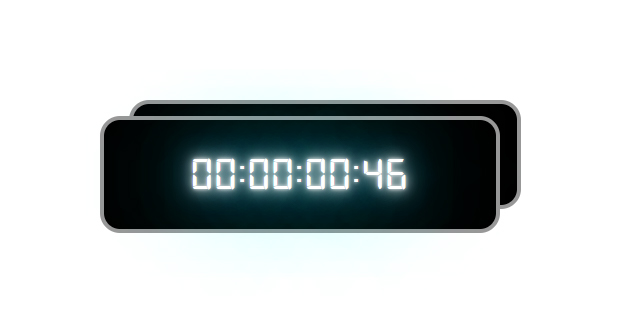

# Плагин таймера обратного отсчета
[Cсылка на демо](https://eduardvorsin.github.io/countdown-timer/index.html)



## Технологии которые использовались


## 🧱 Разметка
```html
<div class="timer timer1">
  <time class="timer__time" data-timer-counter>00:00:00:00</time>
</div>
```

- `data-timer-counter` - атрибут который нужно поставить счетчику, для нахождения этого элемента внутри контейнера

## ⚙️Cкрипты
### Инициализация экземпляра таймера обратного отсчета
```javascript
'use strict';

const timer1 = new CountdownTimer('.timer1', {
  futureDate: `${new Date(Date.now() + 1000 * 60)}`,

  onStart: function (timerContainer, timerCounter) {
    console.log('start');
  },

  onEnd: function (timerContainer, timerCounter) {
    console.log('end');
  },

  onUpdate: function (timerContainer, timerCounter) {
    console.log('update')
  },
});
```
## ✨ Особенности
Если параметр futureDate не задан то таймер заводится на 1 минуту.

При инициализации нового таймера обратного отсчета мы можем передать callback'и:
- `onStart()` - срабатывает при вызове метода start().
- `onEnd()` - срабатывает при остановке работы таймера или при вызове метода reset().
- `onUpdate()` - срабатывает на каждое обновление времени таймера.

В данные коллбеки можно передать 2 параметра: `timerContainer` и `timerCounter`, 1-ый для получения контейнера таймера и 2-ой для счетчика таймера.

При желании можно модифицировать скрипт чтобы время выводилось не в один элемент а несколько, например в элемент для даты, часов, минут, секунд. Также можно добавить какую нибудь анимацию через css или js.
